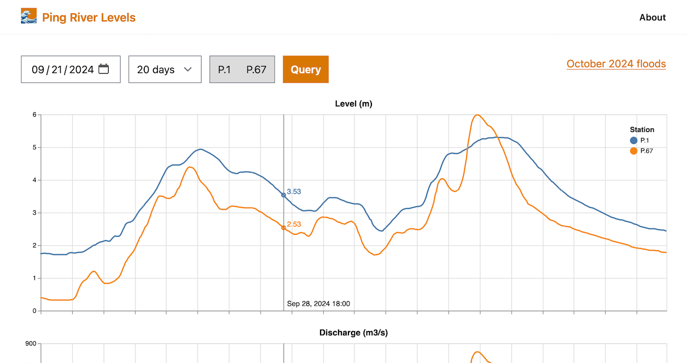

# Ping River Levels

> A [site](https://pingriverlevels.raulrpearson.com/) displaying depth and discharge data for Thailand's Ping River

This Elixir/Phoenix project fetches level and discharge data for the Ping River from Thailand's [Royal Irrigation Department](https://hydro-1.net/). It provides this data as a chart and tables. API endpoints are also available.

I built this site as a fun learning project. Please keep in mind that the information presented here is provided "as is", without warranty of any kind. There could be bugs that produce inaccurate information, so always check the official data sources if you need stronger assurance.

If you have feedback, a feature request or bug report, you can open an [issue](https://github.com/raulrpearson/ping_river_levels/issues).
